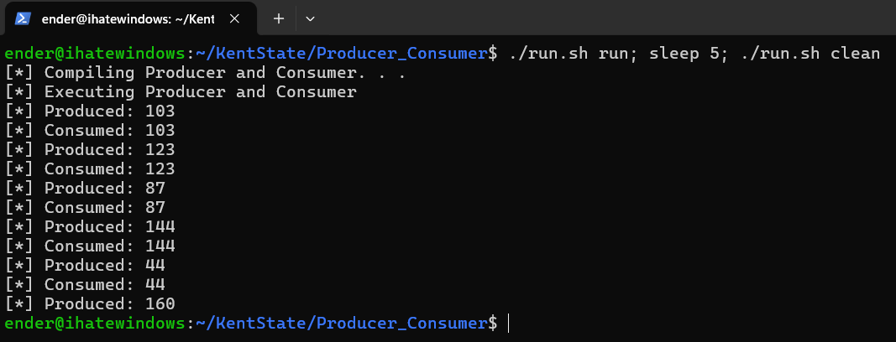

# Producer Consumer Problem

## Assignment:
Write the producer and consumer binaries and show an understanding about the producer-consumer problem.

### Problem: Producer-Consumer
The `producer` "produces" artifacts and inserts them into a shared memory buffer, then the `consumer` "consumes" these artifacts.

When the buffer is full the producer will wait until there is a free'd space. If the buffer is empty the consumer will wait until
something is created. We were asked to use `semaphores` to help synchronize the two processes (producer and consumer). We also
consider `Mutual Exclusion` using a `mutex` which allows us to lock the shared buffer allowing us to ensure only one process is
interacting with the shared buffer at a time, the main operations of the processes are perform through `threads`.

## Compile: :computer:
### Dependencies: :warning:
Install the following dependencies before attempting to build:
```bash
sudo apt update && sudo apt install g++
```

### Build instructions :hammer:
```bash
git clone https://github.com/EndermanSUPREME/Producer_Consumer.git
cd Producer_Consumer
chmod +x run.sh
./run.sh run
```

*More about run.sh*: :scroll:<br>
`./run.sh` is a bash-script used to automate program compiling and clean-up operations, clean-up is needed because producer
and consumer are background processes running infinite loops, meaning if not terminated they run until system
restart or crash in worst case.
```
Usage: ./run.sh [run|clean|help]

Options:
  help      Show this page
  run       Run producer & consumer
  clean     Clean stray producers & consumers
```

## Example Execution: :bulb:
WSL Bash Terminal Output:
```bash
ender@ihatewindows:~/KentState/Producer_Consumer$ ./run.sh run; sleep 5; ./run.sh clean
[*] Compiling Producer and Consumer. . .
[*] Executing Producer and Consumer
[*] Produced: 103
[*] Consumed: 103
[*] Produced: 123
[*] Consumed: 123
[*] Produced: 87
[*] Consumed: 87
[*] Produced: 144
[*] Consumed: 144
[*] Produced: 44
[*] Consumed: 44
```

